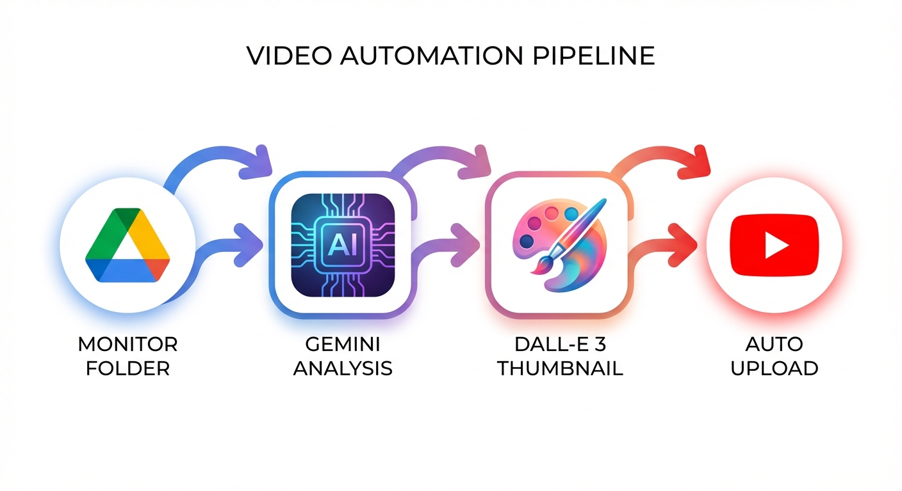
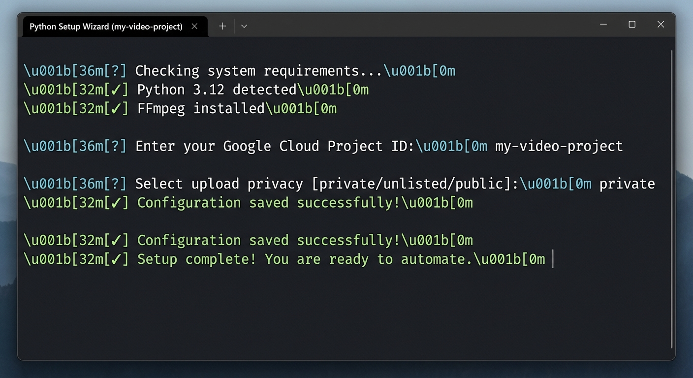

# 🎬 AI Video Automation for YouTube

[](https://www.python.org/downloads/)
[](https://opensource.org/licenses/MIT)
[](https://github.com/psf/black)

An intelligent automation workflow that monitors Google Drive for new videos, analyzes them with AI, generates custom thumbnails using DALL-E 3, and automatically uploads to YouTube with optimized metadata.

> **🎯 For New Users**: This project requires your own Google Cloud, YouTube, and AI API accounts. See the [Complete Setup Guide](SETUP.md) to get started.

---



## ✨ Features

- **🤖 AI-Powered Analysis**: Uses Google Gemini to analyze video content and generate:
  - SEO-optimized titles (≤60 characters)
  - Engaging descriptions with hashtags
  - Custom thumbnail prompts
  
- **🎨 DALL-E 3 Thumbnails**: Generates professional, eye-catching thumbnails with:
  - HD quality (1280x720)
  - Stylish title text overlay
  - Smart people detection (only includes faces when relevant)
  - Auto-compression to meet YouTube's 2 MB limit

- **📤 Automated YouTube Upload**: 
  - Uploads videos with all metadata
  - Sets thumbnails automatically
  - Configurable privacy settings
  - Optional dual-account upload

- **📊 Google Sheets Logging**: Tracks all uploads with timestamps and metadata

- **📁 File Management**: Automatically moves processed videos to a "Done" folder

- **🔄 Retry Logic**: Built-in error handling with automatic retries

---

## 🚀 Quick Start

### For First-Time Users

**New to this project?** Follow these steps:

1. **Read the [Complete Setup Guide](SETUP.md)** - Detailed walkthrough for setting up Google Cloud, APIs, and configuration
2. **Run the Setup Wizard** - Interactive tool to configure everything:
   ```bash
   python setup_wizard.py
   ```

   

3. **Validate Your Setup** - Check that everything is configured correctly:
   ```bash
   python validate_setup.py
   ```
4. **Start the Automation**:
   ```bash
   python main.py
   ```

### For Experienced Users

```bash
# Clone and install
git clone https://github.com/YOUR_USERNAME/video-automation.git
cd video-automation
pip install -r requirements.txt

# Configure (manual method)
cp config.example.py config.py
# Edit config.py with your API keys and folder IDs

# Authenticate
python authenticate.py

# Run
python main.py
```

---

## 📖 Documentation

- 📘 **[Setup Guide](SETUP.md)** - Complete step-by-step setup instructions
- 🔧 **[Troubleshooting](TROUBLESHOOTING.md)** - Common issues and solutions
- ❓ **[FAQ](FAQ.md)** - Frequently asked questions
- 🔒 **[Security](SECURITY.md)** - Security best practices
- 🤝 **[Contributing](CONTRIBUTING.md)** - How to contribute to the project

---

## 🛠️ Tech Stack

- **Python 3.12+**
- **Google APIs**: Drive, YouTube Data API v3, Sheets
- **AI Services**: Google Gemini 2.0, OpenAI DALL-E 3
- **Image Processing**: Pillow (PIL)
- **Video Processing**: FFmpeg (for compression)

---

## 💰 Cost Estimate

**Per video** (approximate):
- Google Gemini analysis: ~$0.01
- DALL-E 3 thumbnail: $0.04
- **Total: ~$0.05 per video**

**Free tier limits**:
- Google Drive API: Free (1B queries/day)
- YouTube API: Free (10,000 units/day ≈ 6 uploads)
- Google Sheets API: Free (500 requests/100s)

See [FAQ](FAQ.md) for more details on costs.

---

## 📋 Prerequisites

1. **Google Cloud Project** with enabled APIs:
   - Google Drive API
   - YouTube Data API v3
   - Google Sheets API

2. **API Keys**:
   - Google Cloud OAuth 2.0 credentials
   - Google Gemini API key
   - OpenAI API key (for DALL-E 3)

3. **Python 3.12+** and **FFmpeg** installed

**See [SETUP.md](SETUP.md) for detailed instructions on obtaining all prerequisites.**

## 📖 How It Works

1. **Monitor**: Checks Google Drive folder every 60 seconds for new videos
2. **Download**: Downloads video file locally for processing
3. **Analyze**: Sends video to Gemini AI for content analysis
4. **Generate**: Creates custom thumbnail with DALL-E 3 and adds title text
5. **Upload**: Uploads video to YouTube with AI-generated metadata
6. **Log**: Records details in Google Sheets
7. **Cleanup**: Moves processed video to Done folder

## 🎯 Use Cases

- Content creators who want to automate their upload workflow
- Teams managing multiple YouTube channels
- Anyone who wants AI-powered video metadata generation
- Automated video processing pipelines

## 🔒 Security Notes

- Never commit `credentials.json`, `token.json`, or `config.py` to Git
- Use environment variables for production deployments
- Keep API keys secure and rotate them regularly

## 📝 Project Structure

```
video_automation/
├── main.py                 # Main workflow orchestration
├── config.py              # Configuration (not in Git)
├── requirements.txt       # Python dependencies
├── services/
│   ├── drive_service.py   # Google Drive integration
│   ├── ai_service.py      # AI analysis & thumbnail generation
│   ├── youtube_service.py # YouTube upload
│   └── sheets_service.py  # Google Sheets logging
└── tests/
    └── test_workflow.py   # Unit tests
```

## 🚀 Future Enhancements

- [ ] Cloud deployment (Google Cloud Run)
- [ ] Multi-language support
- [ ] Batch processing optimization
- [ ] Custom thumbnail templates
- [ ] Video editing capabilities
- [ ] Analytics dashboard

## 📄 License

MIT License - feel free to use this project for your own purposes!

## 🤝 Contributing

Contributions are welcome! Please feel free to submit a Pull Request.

## 👤 About the Author

**kaough**

*AI Automation Enthusiast & Developer*

I built this tool to streamline the video creation process and demonstrate the power of combining modern AI tools. My goal is to make advanced automation accessible to creators of all technical levels.

- 🐙 **GitHub**: [@kaough](https://github.com/kaough)
- 🔧 **Projects**: Focused on AI, Automation, and Python tools
- 🤝 **Open for**: Collaboration on AI and automation projects

## 🙏 Acknowledgments

- Google Gemini for video analysis
- OpenAI DALL-E 3 for thumbnail generation
- Google Cloud Platform for APIs
